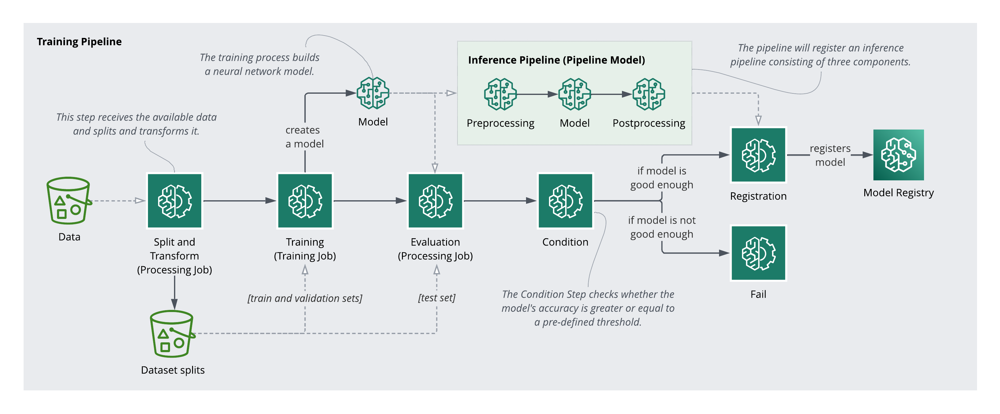

# AWS SageMaker MLOps Pipeline for Penguin Species Classification

## Overview

This project implements an MLOps pipeline using AWS SageMaker to automate the lifecycle of a machine learning model that classifies penguin species. The pipeline integrates data preprocessing, model training and evaluation, conditional model registration, and deployment. It ensures that only models meeting a predefined accuracy threshold are registered, maintaining high standards of model performance.
